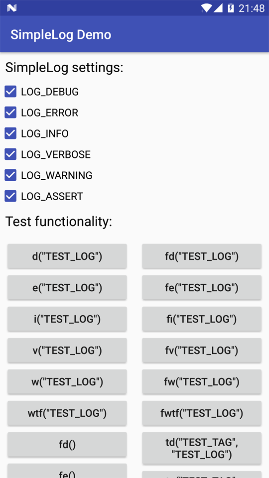

# Extended Log library for Android
**SimpleLog** - an extended library for logging on devices running Android. Unlike the standard log, the library can generate tags and output method names depending on where the log was called, and also solves some additional tasks. In the source files there is a test application, in which you can see the working principle.



### Example of usage:
```java
SimpleLog.d("Test log");
SimpleLog.fd("Test log");
SimpleLog.td("CustomTAG", "Test log");
SimpleLog.tfd("CustomTAG", "Test log");

SimpleLog.e("Test error");
SimpleLog.fe("Test error");
SimpleLog.te("CustomTAG", "Test error");
SimpleLog.tfe("CustomTAG", "Test error");
```

### Gradle:
```gradle
annotationProcessor 'com.don11995.log:simple-log-processor:1.2.4'
implemetation 'com.don11995.log:simple-log:1.2.4'
```

### ProGuard rules for release build:
```proguard
-assumenosideeffects class com.don11995.log.SimpleLog {
    public static void fd();
    public static void fi();
    public static void fe();
    public static void fv();
    public static void fw();
    public static void fwtf();
    public static void d(...);
    public static void i(...);
    public static void e(...);
    public static void v(...);
    public static void w(...);
    public static void wtf(...);
    public static void fd(...);
    public static void fi(...);
    public static void fe(...);
    public static void fv(...);
    public static void fw(...);
    public static void fwtf(...);
    public static void td(...);
    public static void ti(...);
    public static void te(...);
    public static void tv(...);
    public static void tw(...);
    public static void twtf(...);
    public static void tfd(...);
    public static void tfi(...);
    public static void tfe(...);
    public static void tfv(...);
    public static void tfw(...);
    public static void tfwtf(...);
}

-assumenosideeffects class com.don11995.log.Group {
    public void <init>(...);
    public *** append(...);
    public *** tag(...);
}
```